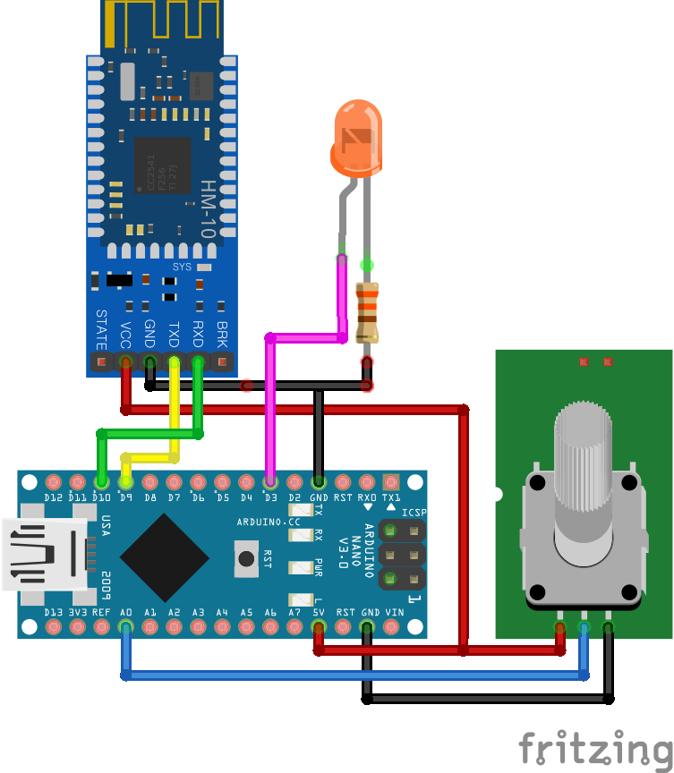

# HM-10 Test with Arduino Nano

BLE를 경험해보기 위해 Arduino NANO에서 HM-10을 다루는 코드를 작성해보았다. 간단히 아래와 같은 것을 해볼 수 있다.
* LED의 밝기, On/Off, 깜빡임 제어하기
* Potentiometer의 아날로그 값을 Central 장치로 보내기

자세한 설명은 [**아두이노에서 HM-10 다루기**](https://monotics.tistory.com/21)**를 참조하면된다.

### Hardware
* Arduino Nano
* HM-10 BLE module
* Potentiometer (B10K)
* LED & 330Ω Register

### Code
* main.cpp, ble.cpp, led.cpp, control.cpp

### Tool
* Visual Studio Code
* PlatformIO extension

### Wiring
* Connect D9 to Tx of HM-10.
* Connect D10 to Rx of HM-10.
* Connect ~D3 to LED
* Connect A0 to Potentiometer

### Testing
* Android 디바이스에 [**nRF Connect for Mobile**](https://play.google.com/store/apps/details?id=no.nordicsemi.android.mcp) 설치
* read command from the central
  * This controls the brightness, on/off and blinking of the LED.
  * Command \
  format: **START(8) | TYPE(8) | LENGTH(8) | DATA ~**
    * LED On  : 0x01110101
    * LED Off : 0x01110100
    * LED Dim : 0x011201xx \
    ex) 50%(0x80) brightness \
    -> 0x01_12_01_80
    * LED Blink : 0x011303xxyyyy \
    ex) 5 times(0x05) with 500ms(0x01C0) interval \
    -> 0x01_13_03_05_01C0
* send analog value to the central
